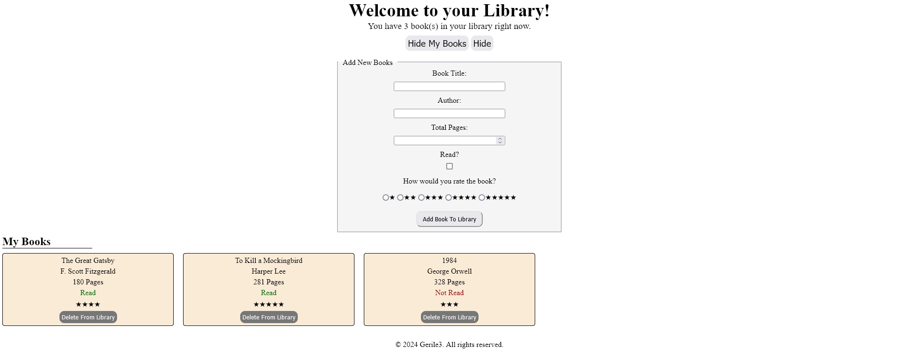

# libraryobj
"Library App" is a simple web application that allows users to manage their personal book collection. Users can add new books, mark them as read or unread, and rate them, with example books displayed by default to get them started.

Have done this to use objects in general and practice forms.

